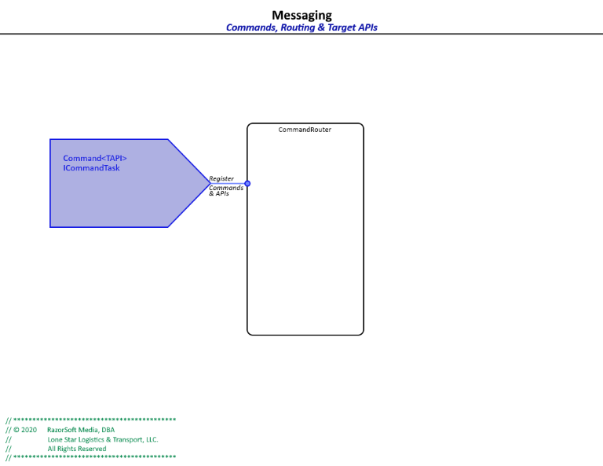

# RazorSoft.Core  
## Messaging
____________________________________________________________________________________________________  
[Home][1] | [Whiteboard][2]

### EventPublisher  
The `EventPublisher` provides a mechanism by which events (messages) can be published by any 
object (Publisher) with a view of the `EventMessage`. Any object with reference to the `EventMessage` 
has the ability to publish - that is, *distribute* - the message to all subscribers.  

  
*EventPublisher diagram*

```cs
//	TODO: insert code samples
```  

### CommandRouter  
The `CommandRouter` provides routing by which commands can be executed. What is unique about the 
`CommandRouter` is how commands are created. There are a couple of methods we can identify/create 
commands:  
* interface
* command object
* hybrid

  
*CommandRouter diagram*

Like publishing `EventMessage` messages, any object with a view (reference to) of a `Command` can 
execute the command.

Given these classes, we can configure commands that can be executed by any object that has reference 
to the API interface. This keeps the API implementation far removed from front end objects. 

`ICalculator` could be any *BusinessLogic* or *DataAccess* API.  

```cs
//	interface as an API
public interface ICalculator {
	int Add (int i1, int i2);
	int Subtract (int i1, int i2);
}

//	API implementation
private class Calculator : ICalculator {
	
	public int Add (int i1, int i2) {
		return i1 + i2;
	}
	
	public int Subtract (int i1, int i2) {
		return i1 - i2;
	}
}
```  

Put *API interfaces* into a *Messaging* library with public exposure keeping implementation details 
behind any number of layers.

1. register the interface as a command API:
```cs
//	somewhere in the back end
internal class BackendClass {
	private static readonly CommandRouter commandRouter = CommandRouter.Default;
	
	internal BackendClass () {
		commandRouter.AddCommandTarget<ICalculator>(new Calculator());
	}	
}
```

2. expose the Command API:
```cs
//	in a publicly accessible library
public static class CalculatorAPI {
	public Command<ICalculator> Calculator = (o) => { return (ICalculator)o; };
}
```

3. use the Command API:
```cs
//	returns 6
var sum = Calculator.Execute((ICalculator c) => c.Add(2, 4));

//	returns 3
var diff = Calculator.Execute((ICalculator c) => c.Subtract(12, 9));
```

Ref:  
    + [Whiteboard][2]: feature suggestions  
    + [Event Publisher Unit tests][3]: use and implementation  
	+ [Command Router Unit tests][4]: use and implementation
____________________________________________________________________________________________________   
© 2020 RazorSoft Media, DBA  
       Lone Star Logistics & Transport, LLC. All Rights Reserved  

[1]: ../../README.md
[2]: ../whiteboard.md
[3]: ../../testing/Test.RazorSoft.Core/EventPublisherTests.cs
[4]: ../../testing/Test.RazorSoft.Core/CommandRouterTests.cs
