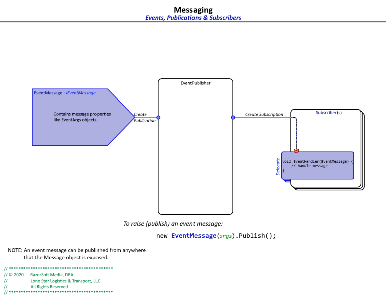

# RazorSoft.Core  
## Messaging
____________________________________________________________________________________________________  
[Home][1] | [Whiteboard][2]

### EventPublisher  
The `EventPublisher` provides a mechanism by which events (messages) can be published by any 
object (Publisher) with a view of the `EventMessage`. Any object with reference to the `EventMessage` 
has the ability to publish - that is, *distribute* - the message to all subscribers.  

  
*EventPublisher diagram*

```cs
//	TODO: insert code samples
```  

### CommandRouter  
The `CommandRouter` provides routing by which commands can be executed. What is unique about the 
`CommandRouter` is how commands are created. There are a couple of methods we can identify/create 
commands:  
* interface
* command object
* hybrid

```cs
//	TODO: insert CommandRouter design diagram
```  
*CommandRouter diagram*

Like publishing `EventMessage` messages, any object with a view (reference to) of a `Command` can 
execute the command.

```cs
//	TODO: insert code samples
```  

Ref:  
    + [Whiteboard][2]: feature suggestions  
    + [Event Publisher Unit tests][3]: use and implementation  
	+ [Command Router Unit tests][4]: use and implementation
____________________________________________________________________________________________________   
© 2020 RazorSoft Media, DBA  
       Lone Star Logistics & Transport, LLC. All Rights Reserved  

[1]: ../../README.md
[2]: ../whiteboard.md
[3]: ../../testing/Test.RazorSoft.Core/EventPublisherTests.cs
[4]: ../../testing/Test.RazorSoft.Core/CommandRouterTests.cs
